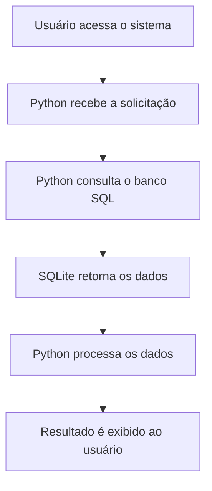
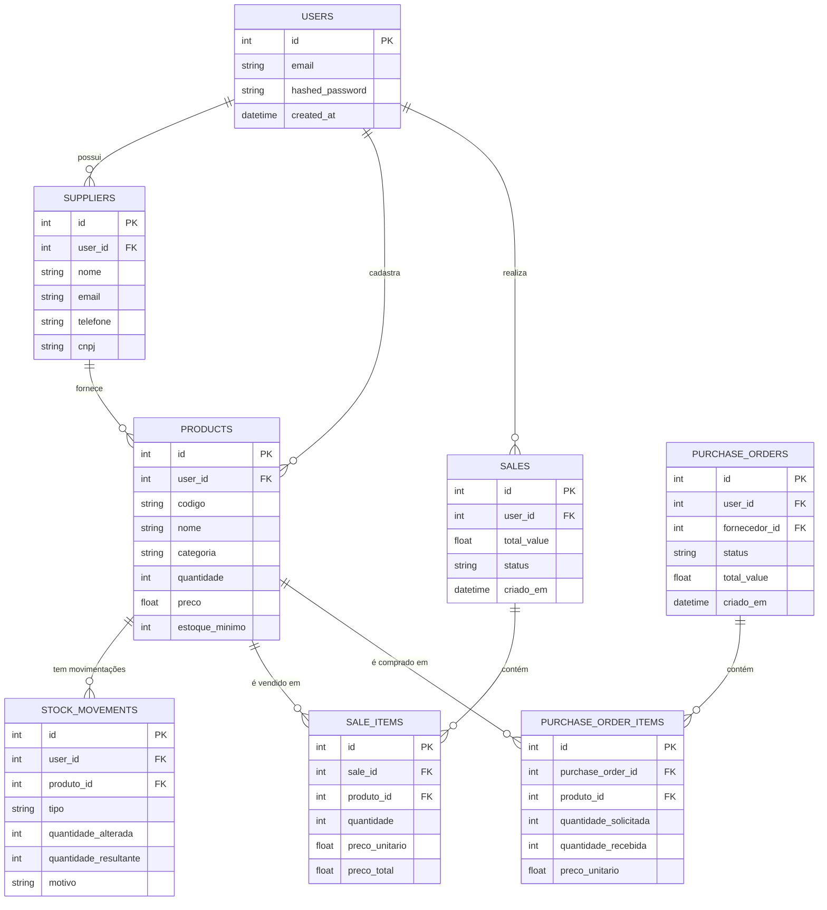

# 🎓 Apresentação para o Professor

## **O que é o PC-Express?**

O **PC-Express** é um sistema de gerenciamento de inventário desenvolvido para demonstrar o uso prático de **Python** e **SQL** em um projeto real. É como um "mini ERP" que gerencia produtos, fornecedores, vendas e estoque de uma loja de informática.

## **Por que Python + SQL?**

**Python** é a linguagem que "conversa" com o banco de dados através do **SQL**. É como ter um tradutor que:
- Recebe comandos em Python (fácil de entender)
- Traduz para SQL (linguagem do banco de dados)
- Executa as operações
- Retorna os resultados em Python

## **Como Funciona o Sistema?**



## **Estrutura do Banco de Dados (SQL)**

Nosso banco tem **7 tabelas principais** que se relacionam entre si:



## **Exemplos Práticos de Python + SQL**

### **1. Cadastrar um Produto**
```python
# Python (o que o programador escreve)
produto = Product(
    nome="Processador Intel i7",
    preco=1200.00,
    quantidade=10,
    categoria="Processador"
)

# SQL (o que acontece no banco automaticamente)
# INSERT INTO products (nome, preco, quantidade, categoria) 
# VALUES ('Processador Intel i7', 1200.00, 10, 'Processador')
```

### **2. Buscar Produtos com Estoque Baixo**
```python
# Python (o que o programador escreve)
produtos_baixo_estoque = db.query(Product).filter(
    Product.quantidade <= Product.estoque_minimo
).all()

# SQL (o que acontece no banco automaticamente)
# SELECT * FROM products 
# WHERE quantidade <= estoque_minimo
```

### **3. Calcular Total de Vendas**
```python
# Python (o que o programador escreve)
total_vendas = db.query(func.sum(Sale.total_value)).scalar()

# SQL (o que acontece no banco automaticamente)
# SELECT SUM(total_value) FROM sales
```

### **4. Relacionamento entre Tabelas (JOIN)**
```python
# Python (o que o programador escreve)
vendas_com_produtos = db.query(Sale, Product).join(
    SaleItem, Sale.id == SaleItem.sale_id
).join(
    Product, SaleItem.produto_id == Product.id
).all()

# SQL (o que acontece no banco automaticamente)
# SELECT s.*, p.* FROM sales s
# JOIN sale_items si ON s.id = si.sale_id
# JOIN products p ON si.produto_id = p.id
```

## **Tecnologias Utilizadas**

| Tecnologia | Para que serve | Exemplo de uso |
|------------|----------------|----------------|
| **Python** | Linguagem principal | Lógica de negócio, cálculos |
| **SQLAlchemy** | ORM (tradutor Python ↔ SQL) | Converte objetos Python em comandos SQL |
| **SQLite** | Banco de dados | Armazena todas as informações |
| **FastAPI** | Framework web | Cria a API que comunica com o frontend |
| **Pydantic** | Validação de dados | Garante que os dados estão corretos |

## **Fluxo de Desenvolvimento**


## **Principais Desafios Resolvidos**

### **1. Relacionamentos entre Tabelas**
- Como conectar produtos com fornecedores e vendas
- Implementação de chaves estrangeiras
- Cascatas para manter integridade

### **2. Integridade dos Dados**
- Garantir que não haja produtos órfãos
- Prevenir vendas inválidas
- Validação de dados obrigatórios

### **3. Performance**
- Otimizar consultas para não travar o sistema
- Índices nas colunas mais consultadas
- Paginação para grandes volumes de dados

### **4. Validação**
- Verificar se os dados estão corretos antes de salvar
- Tipos de dados apropriados
- Regras de negócio implementadas

## **Estrutura do Código Python**

```
app/
├── models.py          # Definição das tabelas (SQLAlchemy)
├── database.py        # Configuração do banco
├── schemas.py         # Validação de dados (Pydantic)
├── crud.py           # Operações CRUD
├── auth.py           # Autenticação
└── routers/          # Endpoints da API
    ├── products.py   # Operações com produtos
    ├── sales.py      # Operações com vendas
    └── suppliers.py  # Operações com fornecedores
```

## **Exemplos de Consultas SQL Complexas**

### **Relatório de Vendas por Categoria**
```sql
SELECT 
    p.categoria,
    COUNT(si.id) as total_vendas,
    SUM(si.preco_total) as receita_total
FROM products p
JOIN sale_items si ON p.id = si.produto_id
JOIN sales s ON si.sale_id = s.id
WHERE s.status = 'COMPLETED'
GROUP BY p.categoria
ORDER BY receita_total DESC;
```

### **Produtos com Estoque Crítico**
```sql
SELECT 
    p.nome,
    p.quantidade,
    p.estoque_minimo,
    (p.quantidade - p.estoque_minimo) as diferenca
FROM products p
WHERE p.quantidade <= p.estoque_minimo
ORDER BY diferenca ASC;
```

## **Resultados Alcançados**

✅ **Sistema Funcional**: Gerencia inventário completo  
✅ **Banco Bem Estruturado**: 7 tabelas relacionadas corretamente  
✅ **Código Python Limpo**: Fácil de entender e manter  
✅ **Consultas SQL Otimizadas**: Sistema rápido e eficiente  
✅ **Validação de Dados**: Previne erros e inconsistências  
✅ **API RESTful**: Endpoints bem organizados e documentados  
✅ **Autenticação Segura**: Sistema de login com JWT  
✅ **Relatórios**: Consultas complexas para análise de dados  

## **Aprendizados Demonstrados**

### **Banco de Dados**
- **Modelagem**: Como estruturar tabelas e relacionamentos
- **Normalização**: Evitar redundância de dados
- **Índices**: Otimizar performance das consultas
- **Integridade Referencial**: Chaves estrangeiras e cascatas

### **Python**
- **ORM com SQLAlchemy**: Como usar Python para trabalhar com SQL
- **Classes e Objetos**: Modelagem orientada a objetos
- **Validação**: Pydantic para garantir qualidade dos dados
- **APIs REST**: FastAPI para criar endpoints

### **SQL**
- **Consultas Complexas**: JOINs, filtros e agregações
- **Funções de Agregação**: SUM, COUNT, AVG, MAX, MIN
- **Subconsultas**: Consultas aninhadas
- **Índices**: Otimização de performance

## **Como Testar o Sistema**

### **1. Iniciar o Sistema**
```bash
# Windows
.\start.ps1

# Linux/Mac
./start.sh
```

### **2. Acessar o Sistema**
- **URL**: http://localhost:5173
- **Login**: admin@pc-express.com
- **Senha**: admin123

### **3. Funcionalidades para Testar**
- ✅ Cadastrar produtos
- ✅ Cadastrar fornecedores
- ✅ Realizar vendas
- ✅ Ver relatórios
- ✅ Testar alertas de estoque

## **Conclusão**

O **PC-Express** demonstra de forma prática como integrar **Python** e **SQL** em um sistema real, mostrando:

- **Modelagem de banco de dados** com relacionamentos complexos
- **Uso de ORM** para simplificar operações com banco
- **Validação de dados** para garantir qualidade
- **Consultas SQL otimizadas** para performance
- **Arquitetura limpa** e bem organizada

Este projeto serve como exemplo de como aplicar conceitos de banco de dados e programação Python em um cenário real de desenvolvimento de software.

---

**Equipe Big 5:**
- Lucca Phelipe Masini RM 564121
- Luiz Henrique Poss RM 562177  
- Luis Fernando de Oliveira Salgado RM 561401
- Igor Paixão Sarak RM 563726
- Bernardo Braga Perobeli RM 56246
